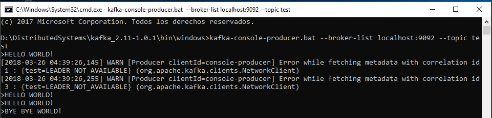
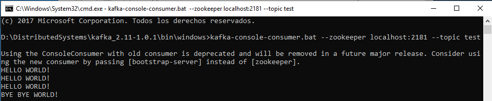

[](https://www.codacy.com/app/alejgh/InciDashboard_i2b?utm_source=github.com&amp;utm_medium=referral&amp;utm_content=Arquisoft/InciDashboard_i2b&amp;utm_campaign=Badge_Grade)
[](https://codecov.io/gh/Arquisoft/InciDashboard_i2b)
[](https://travis-ci.org/Arquisoft/InciDashboard_i2b)
[](https://circleci.com/gh/Arquisoft/InciDashboard_i2b)


# InciDashboard_i2b
The Incident Dashboard is a module of the Incident System used by the incident management staff in order to visualize and manage the incidents that appear in the system.

## 2018 Team Members

* Pablo González Balbuena (@pbalbuena)
* Sergio Faya Fernández (@SergioFaya)

## 2018 Contributors
* Alejandro González Hevia (@alejgh)

## Running the application 
There are two different possibilities in order to run the Incident Manager.

### Using Docker (recommended)
In order to run the module using Docker you just need to install just one dependency: Docker itself. You can download Docker from their [official site](https://www.docker.com/community-edition#/download).

Once you installed docker you have to start the Docker daemon and open a new command line if you are on Mac or Linux, or just open the Docker quickstart terminal if you are on Windows. After that, you execute `docker-compose up` inside the root directory of the Dashboard, where the docker-compose.yml file is located.

Once you execute this command, Docker Compose will launch three containers:
* A container running zookeper on port 2181.
* A container running kafka on port 9092.
* A container running mongo on port 27018.
* A container running the Incidence Dashboard application, listening on port 8082.

Once the application is running you can connect to it using http://localhost:8082 if you are running on Mac or Linux. If you are running it on Windows you will have to use the private IP specified when you start running Docker.

Finally, when you are finish you can gracefully stop the containers from the command line pressing Control+C.

### Without using Docker
#### Kafka
First of all, you need to download Apache Kafka.

`>> tar -xzf kafka_2.11-1.0.1.tgz`

`>> cd kafka_2.11-1.0.1`

Before starting Apache Kafka, as it uses Zookeeper, you need to first start a ZooKeeper server if you don't already have one. You can use a script packaged with kafka to get a quick single-node ZooKeeper instance.

`>> bin\windows\zookeeper-server-start.bat config/zookeeper.properties`

Now, you can start the Kafka server.

`>> bin\windows\kafka-server-start.bat config/server.properties`

To test that kafka is working you can create a producer and a consumer to send and receive information. First of all, create a producer to send messages. This is located in port 9092 with the topic name test.

`>> bin\windows\kafka-console-producer.bat --broker-list localhost:9092 --topic test`

Then create  the consumer, you need the zookeper port, in this case 2181, and the name of the topic you are listening to.

`>> kafka-console-consumer.bat --zookeeper localhost:2181 --topic test`




#### Mongo DB
This is the database of the system. You can download Mongo from [here](https://www.mongodb.com/download-center). After following the installation proccess you have to go to the folder where you downloaded it and then run it using:

`>> bin/mongod —port 27018`

We will be using the port 27018 instead of the default port (27017), as that port is used by the Agents and Loader modules.

#### Maven
Finally, you can start the application from the command line using [maven](https://maven.apache.org/). You can start the application with the following command:

`>> mvn spring-boot:run`

### Logging in the system
Once you start the application and go to http://localhost:8082 you will be redirected to the operators logging form. We have several operator accounts available for testing purposes. One of them is:
```
email: operator1@dashboard.com
password: 123456
```
Once you are logged in you can see real time graphics of all the incidents received in the system. You can also see your assigned incidents going to http://localhost:8082/incidents (or clicking on the correponding link in the nav bar). Inside this list you have the possibility of changing the state of any incident or adding comments to it.
